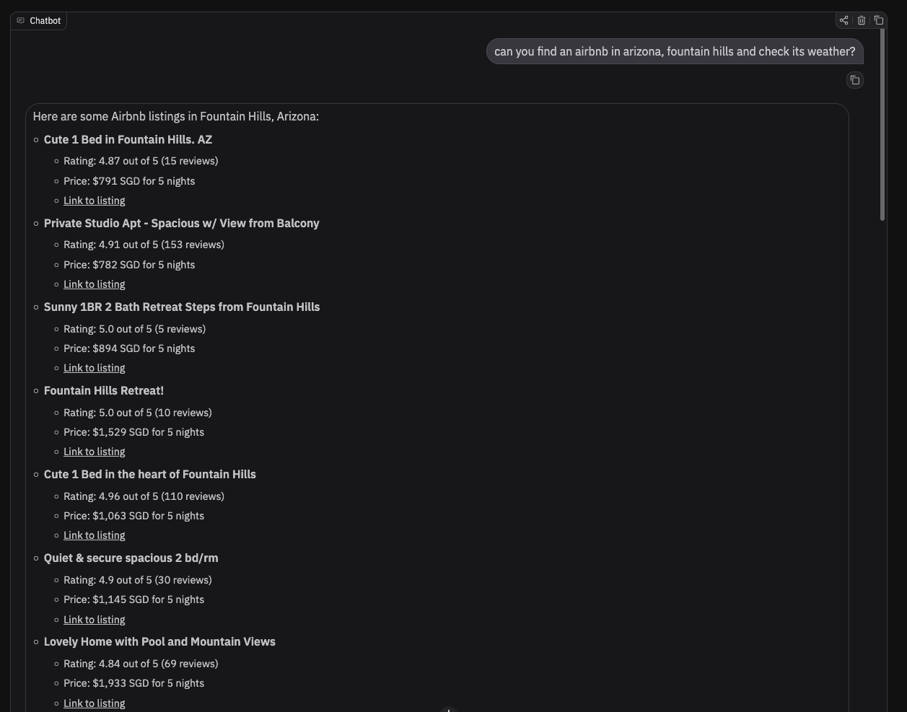

# https://github.com/a2aproject/a2a-samples/tree/main/samples/python/agents/airbnb_planner_multiagent

## Screenshots

### Given the query: `can you find an airbnb in arizona, fountain hills and check its weather?`, it shows

