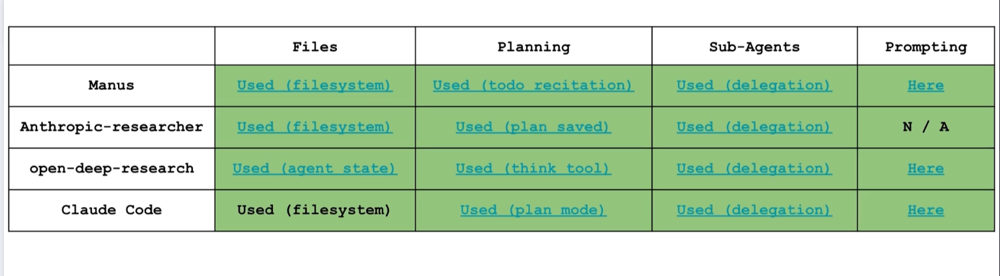

- a plan is generated and written to disk for future reference
- filesystem used to do a few things (long-term-memory):
  - offload context, allow the agent to run off to do its thing, and when it comes back it'll reference the context to ensure the generated content is in line
  - offload tool message, when the content is needed just summarise the results back, prevent raw tool observation from bursting the llm context window
- 

- We can use `Injected<something>` to allow a tool to recieve a STATE, without passing the state to an llm. Use `Command` class to update langgraph state and tell the agent where to go next
  - this is deprecated in langchain v1, now it uses `ToolRuntime`: https://docs.langchain.com/oss/python/langchain/tools#accessing-context
- `create-react-agent` performs parallel tool calls by default
- claude code has a tool called `TodoWrite` for planning; manus uses a `todo.md` file
- files as reference
- Instead of a planner step, seems like others like to use tools to: create, read, write plans to a file or state
- Seems like subagents are used as a tool instead of a specific node

===

1. If I want to use files as context, where do I store them? Such that it is easily accessible for both the users and agent

# Final Thoughts

1. A good crash course on how to build deep agents from scratch
2. Would've love to see how they'd handle actual files as a context, instead of mocking it in state
3. Shows how versatile tools are, for example:
    - plan tool: use it to create a plan for the agent to follow, instead of being a node (plan and execute)
    - subagent tool: create a subagent on the fly as a tool, instead of being part of a subgraph

# Extra thoughts 

- a plan is created for the agent to know what needs to be done, so there is in progress, pending and done
- meanwhile there is a write file to the system to help remind agent what needs to be done. are they supposed to combined both plan and filesystem together?. no leh, upon reading further. it says that the file write is only meant for context offloading, and not something simple like store what needs to be done. i think the example was way too simple. so i think the flow of using the file system should be
  - user request -> check existing file -> doesn't exist -> perform tool search -> offload tool observation to file -> check existing file -> read file -> pass to llm to see if need call -> no need call -> then return final result
- clearly nobody thought through the examples for files and plan, why do I store the user request into a file, when there is already a todo in state?
  - i kinda get it, if its over a 100 turns, storing user request makes sense. but i feel like the tutorial was meant more for offloading large context rather than user request. so shouldn't the focus be the former compared to the latter
  - i should rewrite it properly in TS where it saves the tool observation rather than just the user request
- when creating subagents as tool, its just one tool but it'll know how the different subagents and it can be simply called as `create_react_agent` is used to create these subagent.
  - but this implementation is hella flaky, it depends on how smart the agent is if not the subagent name will mess it uup