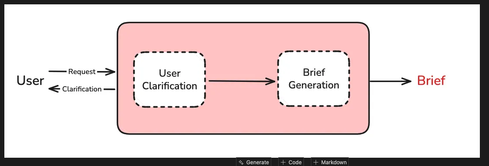

# Phase 1 (SCOPING)

- converse with the user to get requirements and context. Then consolidating the information to a research brief, that'll steer the agent in a certain direction
- steps
  1. Converse with the user to get requirement
  2. Generate research brief (aim of the research)



- get_buffer_string can be used to collpase all messages into a string

- for evaluation we can use `langsmith.evaluate`, the evaluators we pass in ALWAYS have fixed parameters like `evaluator(outputs, reference_outputs)`. read more here, https://docs.langchain.com/langsmith/code-evaluator#basic-example. 
  - `outputs` contains result from the agent we're evaluating against. In this phase it is the `research_brief`
  - `reference_outputs` contains result from what we uploaded in the dataset
- the flow for evaluation is: come up with your expected input and output -> create dataset based on it -> create evaluation fn -> call evaluation fn

# Phase 2 (Multi Agent)

- introduce hard limits to agent like: stop when you're confident, use 2-3 tool for simple task but 5 tool for complex. Stop after 5 search tool if cannot find. We can keep track of the tool calls made.
- introduce thinking tool to analyze the results (https://www.anthropic.com/engineering/claude-think-tool), to prevent spiralling
- use a compression node to summarize and compress research findings. but we need to be careful of losing valuable information. SO we need to remind the LLM of what is important based on the conversation we had with the user. Basically reminding it of it was supposed to do before doing a 'destructive' action.
- another thing i didn't of is to summarize search results instead just passing it down
- good to read
  - https://cognition.ai/blog/dont-build-multi-agents
- TIL theres `filter_message` utils to grab what you need out of the entire `messages` object


# Tots

## 2_research_agent.ipynb

In this section, it shows me that the techniques employed above, transforms a problematic research behavior to a efficient pattern. BUT it they don't TELL me whats so inefficient about the first research behavior. Just because we added ThinkTool it's more efficient? 

```
#### Results
These techniques transform problematic research behavior like:
```
"best coffee shops SF" → "Saint Frank Coffee details" → "Sightglass Coffee details" → "Ritual Coffee details" → etc. (20+ searches)
```

Into efficient patterns like:
```
"best coffee shops SF" → ThinkTool(analyze results) → "SF specialty coffee quality ratings" → ThinkTool(assess completeness) → provide answer (3-5 searches total)
```

```

Ah, I guess its because without the `ThinkTool` LLM tend to go down a rabbit hole which wastes token. Using the `ThinkTool` it will reflect on what it has done and know when to stop when needed.