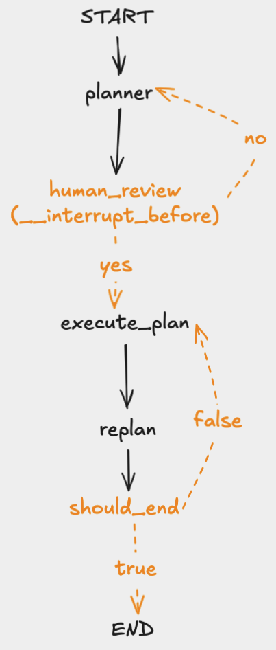

# Human In the Loop with Plan and Execute

## Overview

## Notes
* Node version is `20.3.0`
* Using the `interrupt` function for human in the loop instead of using `interruptBefore` or `interruptAfter`

## Instructions
1. Make sure you're on the correct node version. Use either [mise](https://mise.jdx.dev/installing-mise.html) or [nvm](https://github.com/nvm-sh/nvm#installing-and-updating) to manage your node version
1a. If you're using `mise` run `mise trust && mise install` in the root directory to install the node version specified
2. In this directory, run `npm install` to install the required dependencies
3.

## Graph Flow

# Resources
* [LangGraph interrupt: Making it easier to build human-in-the-loop agents](https://www.youtube.com/watch?v=6t7YJcEFUIY&t=278s)
* https://langchain-ai.github.io/langgraphjs/concepts/human_in_the_loop
* https://langchain-ai.github.io/langgraphjs/tutorials/plan-and-execute/plan-and-execute/
